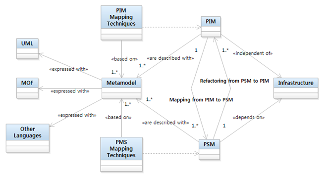

# 모붕이의 github 홈페이지
 
## 프로젝트 주제
통합계좌 관리 금융시스템입니다.
## 전체 설계도
 
[발표자료](/project.pdf) 
## 유튜브 동영상
과제1 동영상입니다.
<iframe width="560" height="315" src="https://www.youtube.com/embed/cT2gRLwvMF8" frameborder="0" allow="accelerometer; autoplay; clipboard-write; encrypted-media; gyroscope; picture-in-picture" allowfullscreen></iframe>

과제2 동영상입니다.
<iframe width="560" height="315" src="https://www.youtube.com/embed/pM-Z49-UK0M" frameborder="0" allow="accelerometer; autoplay; clipboard-write; encrypted-media; gyroscope; picture-in-picture" allowfullscreen></iframe>

## Reference
[검색엔진](https://naver.com)
[Repository 1](https://github.com/moboong/HelloWorld_Java_2021.git)
